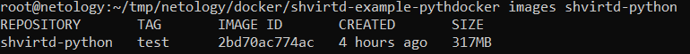
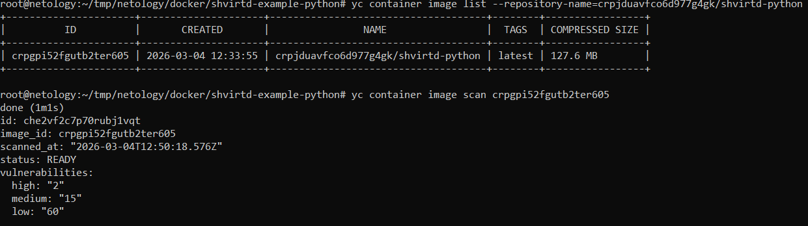
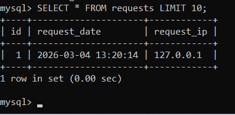
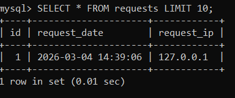
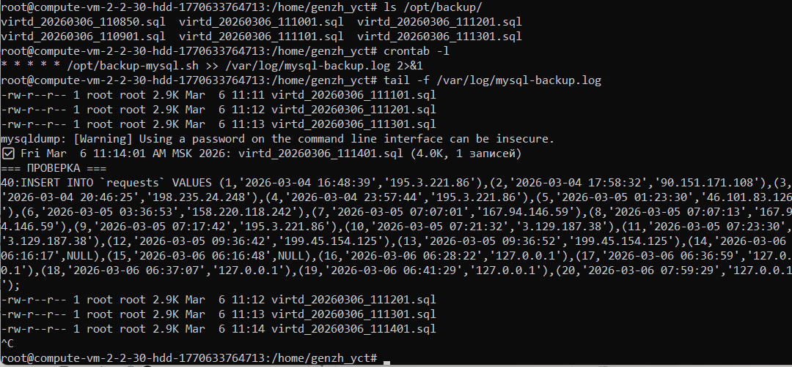
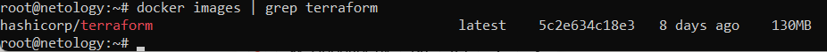
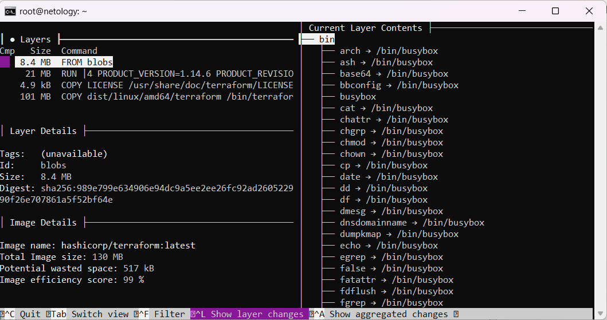
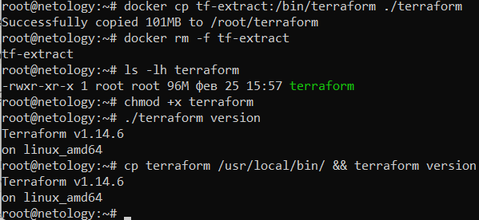
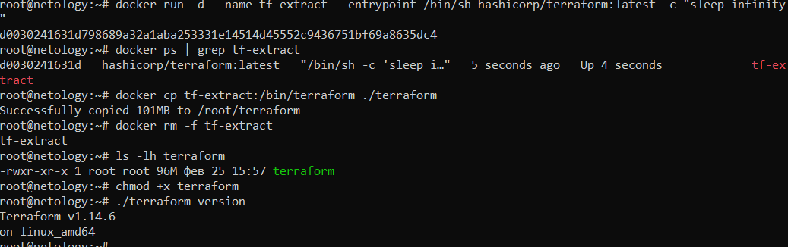

Задачние 1.

Задание 2.

Задание 3.

Задание 4.

GitHub Fork: https://github.com/genzh/shvirtd-example-python

Задание 5.

.gitignore:
/opt/backup-mysql.sh
/opt/backup/
/var/log/mysql-backup.log

Задание 6.

Задание 6.1

